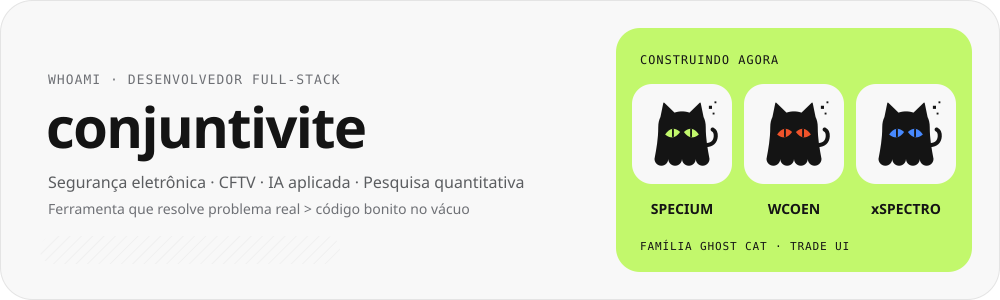
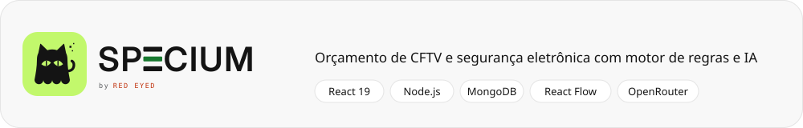
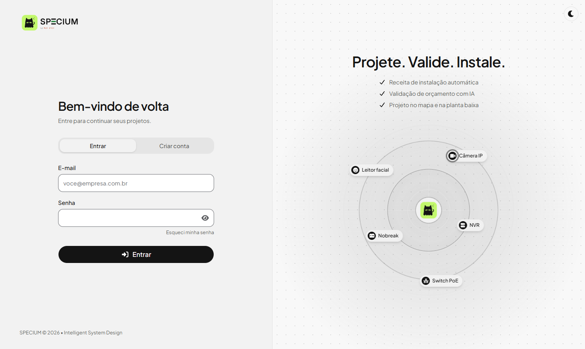
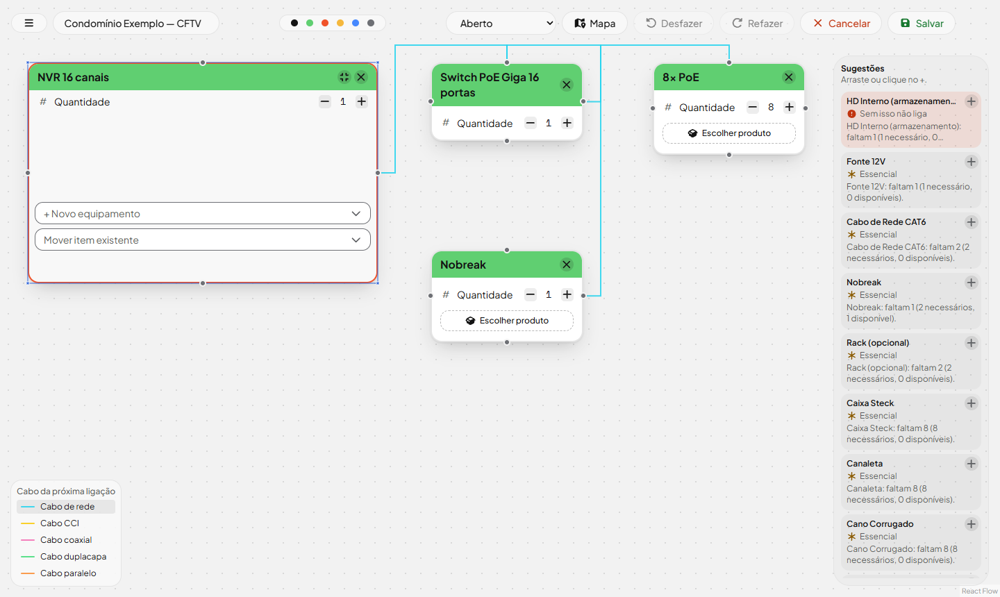
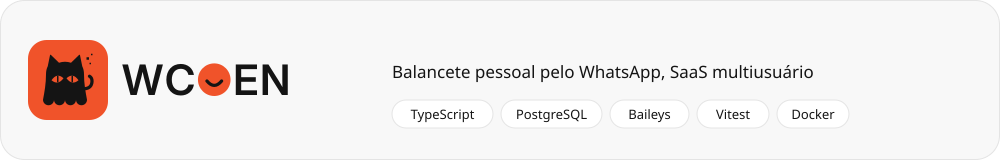
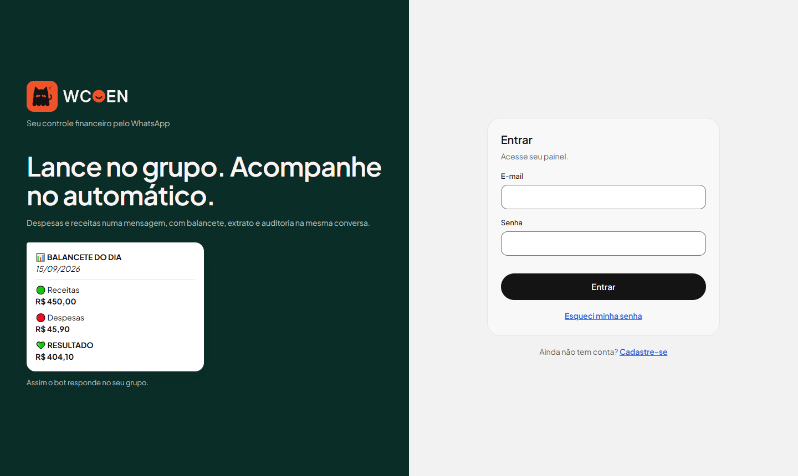
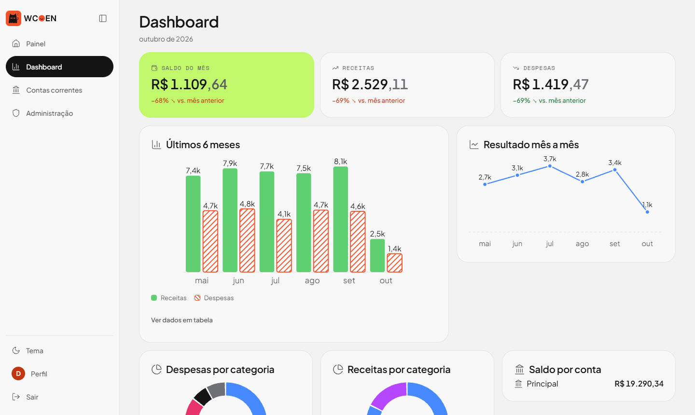
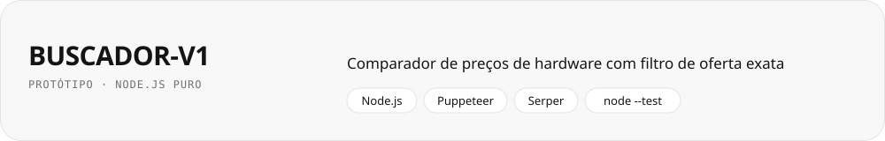

<div align="center">

<picture><source media="(prefers-color-scheme: dark)" srcset="assets/hero-dark.svg"></picture>

<a href="https://github.com/conjuntivite/SPECIUM"><b>SPECIUM</b></a> &nbsp;·&nbsp;
<a href="https://github.com/conjuntivite/WCOEN"><b>WCOEN</b></a> &nbsp;·&nbsp;
<a href="https://github.com/conjuntivite/BUSCADOR-V1"><b>BUSCADOR</b></a>


[](https://github.com/conjuntivite)


</div>

Desenvolvedor full-stack com foco em **soluções pra segurança eletrônica e CFTV** — do
levantamento técnico à automação de orçamento e instalação. Gosto de construir ferramentas que
resolvem um problema real do dia a dia, não só código bonito no vácuo.


<picture><source media="(prefers-color-scheme: dark)" srcset="assets/sec-sobre-dark.svg"></picture>

```javascript
const conjuntivite = {
  papel: "Desenvolvedor Full-Stack",
  foco: ["segurança eletrônica", "CFTV", "automação de orçamento", "IA aplicada", "pesquisa quantitativa"],
  construindoAgora: [
    "SPECIUM — Intelligent System Design",
    "WCOEN — balancete pessoal pelo WhatsApp",
    "xSPECTRO — laboratório quantitativo auditável (cripto, só dry-run)",
  ],
  stack: {
    frontend: ["React 19", "Vite", "Tailwind CSS", "shadcn/ui", "React Flow"],
    backend: ["Node.js (puro, sem framework)", "TypeScript", "MongoDB", "PostgreSQL", "Docker", "Baileys (WhatsApp)"],
    mapas: ["Leaflet", "MapLibre", "OpenStreetMap"],
    quant: ["Python", "Freqtrade", "pandas", "PyTorch (ROCm)"],
    ia: ["OpenRouter (DeepSeek V4 Flash)", "Claude Code"],
    design: "Trade UI — design system próprio, tema claro/escuro",
  },
  filosofia: "ferramenta que resolve problema real > código bonito no vácuo",
};
```


<picture><source media="(prefers-color-scheme: dark)" srcset="assets/sec-stack-dark.svg"></picture>

<div align="center">

**Front-end**<br>


**Back-end**<br>


-25D366?style=for-the-badge&logo=whatsapp&logoColor=white)

**Mapas**<br>


**Dados e quant**<br>


**IA e ferramentas**<br>


</div>


<picture><source media="(prefers-color-scheme: dark)" srcset="assets/sec-destaque-dark.svg"></picture>

<a href="https://github.com/conjuntivite/SPECIUM"><picture><source media="(prefers-color-scheme: dark)" srcset="assets/card-specium-dark.svg"></picture></a>

<table>
<tr>
<td width="50%"><picture><source media="(prefers-color-scheme: dark)" srcset="assets/specium-login-dark.png"></picture></td>
<td width="50%"><picture><source media="(prefers-color-scheme: dark)" srcset="assets/specium-canvas-dark.png"></picture></td>
</tr>
<tr>
<td align="center"><sub>Login: Projete. Valide. Instale.</sub></td>
<td align="center"><sub>Canvas do orçamento: itens ligados por tipo de cabo e as sugestões do motor (dados de exemplo)</sub></td>
</tr>
</table>

Sistema completo pra orçamento de instalação de CFTV e segurança eletrônica — o comercial monta o
projeto num canvas e o sistema aponta o que falta pra instalação funcionar de verdade.

| | |
|---|---|
| 🧩 **Canvas de orçamento** | Quadro visual com React Flow, containers (rack com equipamentos dentro) e ligações por tipo de cabo (rede, CCI, coaxial, dupla capa, paralelo) |
| 💡 **Motor de sugestões** | Recalcula a cada item o que falta (switch PoE, cabo, fonte, gravação), separando essencial de recomendado |
| 🤖 **Validação de PDF com IA** | Lê um orçamento pronto em PDF, classifica os itens em lotes e aponta erros e faltas (DeepSeek via OpenRouter). Uma **memória de classificação** no banco reaproveita respostas anteriores: orçamento com itens já conhecidos nem chama a IA |
| 🗺️ **Mapa e planta baixa** | Posiciona câmeras no endereço real ou na planta, com área de cobertura por resolução (IEC 62676-4) |
| 📦 **Catálogo** | +450 produtos em +140 categorias, com ficha técnica e comparação lado a lado; exporta e importa para um arquivo versionado no Git |
| 📑 **Fichas de datasheets oficiais** | Intelbras, Hikvision, ONE e SIAM validados no datasheet do fabricante (alimentação, PoE, zonas, compatibilidade entre linhas) — a IA consulta só a ficha do modelo citado |
| 🛎️ **Assistente de projeto** | Monta o projeto a partir de regras fixas dos fabricantes (SIAM/ONE: facial por marca, antena veicular na rede, 1 acesso por controladora, sensores e barreiras) e importa direto pro canvas |
| 🔐 **Acesso** | Etapas do orçamento (aberto → negociação → fechado) e permissão por tela, editável pelo admin, que também cadastra usuários pela tela |
| 🎨 **Trade UI** | Design system próprio (tokens, componentes, tema claro e escuro) compartilhado com o WCOEN. Arquitetura documentada em [`docs/ARCHITECTURE.md`](https://github.com/conjuntivite/SPECIUM/blob/main/docs/ARCHITECTURE.md) |


<picture><source media="(prefers-color-scheme: dark)" srcset="assets/sec-outros-dark.svg"></picture>

<a href="https://github.com/conjuntivite/WCOEN"><picture><source media="(prefers-color-scheme: dark)" srcset="assets/card-wcoen-dark.svg"></picture></a>

<table>
<tr>
<td width="50%"><picture><source media="(prefers-color-scheme: dark)" srcset="assets/wcoen-entrar-dark.png"></picture></td>
<td width="50%"><picture><source media="(prefers-color-scheme: dark)" srcset="assets/wcoen-dashboard-dark.png"></picture></td>
</tr>
<tr>
<td align="center"><sub>Entrada do portal, com a prévia do balancete que o bot envia</sub></td>
<td align="center"><sub>Dashboard: saldo do mês, últimos 6 meses, resultado mês a mês e categorias (dados de exemplo)</sub></td>
</tr>
</table>

Um bot de WhatsApp que registra despesas e receitas por comandos num grupo (`/d mercado 45,90`,
`/r plantão 70`), guarda tudo no PostgreSQL (Docker ou Supabase) e responde com balancetes, extrato e
uma auditoria com IA. Roda como **SaaS multiusuário**: cada cliente se cadastra no portal por convite,
conecta o próprio WhatsApp e tem dashboard, contas correntes e administração. Sobe com Docker + Caddy ou
no Render. Feito com TypeScript e testado (Vitest), sem usar a API oficial (paga) do WhatsApp.
Arquitetura em [`docs/ARCHITECTURE.md`](https://github.com/conjuntivite/WCOEN/blob/main/docs/ARCHITECTURE.md).

| | |
|---|---|
| 💬 **Comandos curtos** | `/d` despesa, `/r` receita, `/t` transferência, `/desfazer`; data opcional `dd/mm` e `@conta` em qualquer posição |
| 🏦 **Contas correntes** | Várias contas por cliente, com favorita, saldo inicial e transferência entre elas (fora do balancete) |
| 📸 **Nota por foto** | Foto do cupom com `/nota`: a IA lê total, data e emitente e o bot devolve o comando pronto; `/ok` lança |
| 📊 **Relatórios** | Balancete do dia, resumos mensal, semanal e anual, e extrato paginado do mais recente ao mais antigo |
| 🔎 **Auditoria com IA** | Ranking dos maiores gastos e comparação com o período anterior calculados em código; a IA (OpenRouter) só escreve as dicas |
| 👥 **Portal web** | Cadastro por convite, conexão do WhatsApp por QR, dashboard (saldo, 6 meses, categorias), papéis com validade de acesso e administração |
| 🛡️ **Confiabilidade** | Só confirma depois de gravar, recupera mensagens enviadas com o bot offline, reconecta sozinho, cifra as credenciais do WhatsApp no banco e nunca manda dados a modelo gratuito |

<picture><source media="(prefers-color-scheme: dark)" srcset="assets/card-xspectro-dark.svg"></picture>

Laboratório de pesquisa quantitativa em cripto (Binance Spot, só long e **só dry-run**). A regra do projeto é
a disciplina científica: toda hipótese é pré-registrada antes de rodar, os dados têm manifesto com sha256, o
período fora da amostra fica protegido e cada fase passa por auditoria externa antes da próxima. Resultado
ruim é registrado como resultado, não é "ajustado" até passar.

| | |
|---|---|
| 🧪 **Experimentos pré-registrados** | Hipótese, métricas e critérios fixados antes de rodar; emendas só por registro append-only |
| 🤖 **Bots Freqtrade em shadow** | Bots com e sem um "Sentinel" de risco (notícias + Fear & Greed + LLM) comparados lado a lado, em Docker |
| 📈 **Validação prospectiva** | Estratégia aprovada no histórico roda em dry-run com replay semanal e paradas automáticas (drawdown, divergência, identidade) |
| 🔮 **Modelos de base** | Avaliação do Kronos (previsão de candles) contra baselines simples, com benchmark em GPU AMD (ROCm) |
| 🔒 **Live impossível** | Sem chave de exchange; bloqueio em várias camadas e API dos bots nunca publicada |

<a href="https://github.com/conjuntivite/BUSCADOR-V1"><picture><source media="(prefers-color-scheme: dark)" srcset="assets/card-buscador-dark.svg"></picture></a>

Você informa a peça (categoria, marca e modelo) e o servidor busca ofertas em várias lojas, descarta
o que não é o produto exato e devolve tudo ordenado por preço em reais. Servidor em Node.js puro (sem
framework), front-end estático em JS vanilla e testes com o runner nativo do Node (`node --test`).

| | |
|---|---|
| 🛒 **Vários provedores** | KaBuM! (lê o JSON da própria página, sem chave), Amazon (Chrome headless com Puppeteer) e Google Shopping via Serper e SerpApi (pagos, opcionais) |
| 🎯 **Oferta exata** | Normaliza os títulos e filtra o que não bate com o modelo pedido, em vez de listar tudo que aparece na busca |
| ⚖️ **Comparação de ficha técnica** | Compara 2 ou 3 ofertas: CPU, GPU e disco com benchmark do PassMark (cache de 24 h); RAM, placa-mãe e fonte lidas do título |
| 🚧 **Sem burlar proteção anti-bot** | Lojas com bloqueio (Terabyte, Pichau, Mercado Livre, Magalu) foram avaliadas e deliberadamente ficaram de fora |


<picture><source media="(prefers-color-scheme: dark)" srcset="assets/sec-stats-dark.svg"></picture>

<div align="center">


</div>

<details>
<summary>🏆 Troféus</summary>
<br>


</details>


<picture><source media="(prefers-color-scheme: dark)" srcset="assets/sec-waka-dark.svg"></picture>

<!--START_SECTION:waka-->


**🐱 Meus dados no GitHub** 

> 📦 4.3 kB Usado no armazenamento do GitHub 
 > 
> 🏆 327 Contribuições no ano de 2026
 > 
> 🚫 Não aberto para contratação
 > 
> 📜 6 Repositórios Públicos 
 > 
> 🔑 0 Repositórios Privados 
 > 
**Eu sou diurno 🐤** 

```text
🌞 Manhã                  509 commits         ██████░░░░░░░░░░░░░░░░░░░   22.06 % 
🌆 Tarde                  842 commits         █████████░░░░░░░░░░░░░░░░   36.50 % 
🌃 Noite                  668 commits         ███████░░░░░░░░░░░░░░░░░░   28.96 % 
🌙 Madrugada              288 commits         ███░░░░░░░░░░░░░░░░░░░░░░   12.48 % 
```
📅 **Sou mais produtivo em Sexta-Feira** 

```text
Segunda-Feira            578 commits         ██████░░░░░░░░░░░░░░░░░░░   25.05 % 
Terça-Feira              199 commits         ██░░░░░░░░░░░░░░░░░░░░░░░   08.63 % 
Quarta-Feira             170 commits         ██░░░░░░░░░░░░░░░░░░░░░░░   07.37 % 
Quinta-Feira             178 commits         ██░░░░░░░░░░░░░░░░░░░░░░░   07.72 % 
Sexta-Feira              623 commits         ███████░░░░░░░░░░░░░░░░░░   27.00 % 
Sábado                   512 commits         ██████░░░░░░░░░░░░░░░░░░░   22.19 % 
Domingo                  47 commits          █░░░░░░░░░░░░░░░░░░░░░░░░   02.04 % 
```


📊 **Esta semana eu gastei meu tempo em** 

```text
🕑︎ Fuso horário: America/Sao_Paulo

💬 Linguagens de programação: 
Nenhuma atividade rastreada esta semana

🔥 Editores: 
Nenhuma atividade rastreada esta semana

🐱‍💻 Projetos: 
Nenhuma atividade rastreada esta semana

💻 Sistema operacional: 
Nenhuma atividade rastreada esta semana
```

🤖 **AI Coding This Week** 

```text
No AI Coding Activity Tracked This Week
```

**Eu geralmente programo em JavaScript** 

```text
JavaScript               2 repos             ████████████░░░░░░░░░░░░░   50.00 % 
Python                   1 repo              ██████░░░░░░░░░░░░░░░░░░░   25.00 % 
TypeScript               1 repo              ██████░░░░░░░░░░░░░░░░░░░   25.00 % 
```


**Linha do tempo**


 Last Updated on 09/10/2026 10:49:47 UTC
<!--END_SECTION:waka-->


<picture><source media="(prefers-color-scheme: dark)" srcset="assets/sec-snake-dark.svg"></picture>

<picture>
  <source media="(prefers-color-scheme: dark)" srcset="https://raw.githubusercontent.com/conjuntivite/conjuntivite/output/github-contribution-grid-snake-dark.svg">
  
</picture>


<picture><source media="(prefers-color-scheme: dark)" srcset="assets/sec-contato-dark.svg"></picture>

[](mailto:tawan.barbosa@gmail.com)
